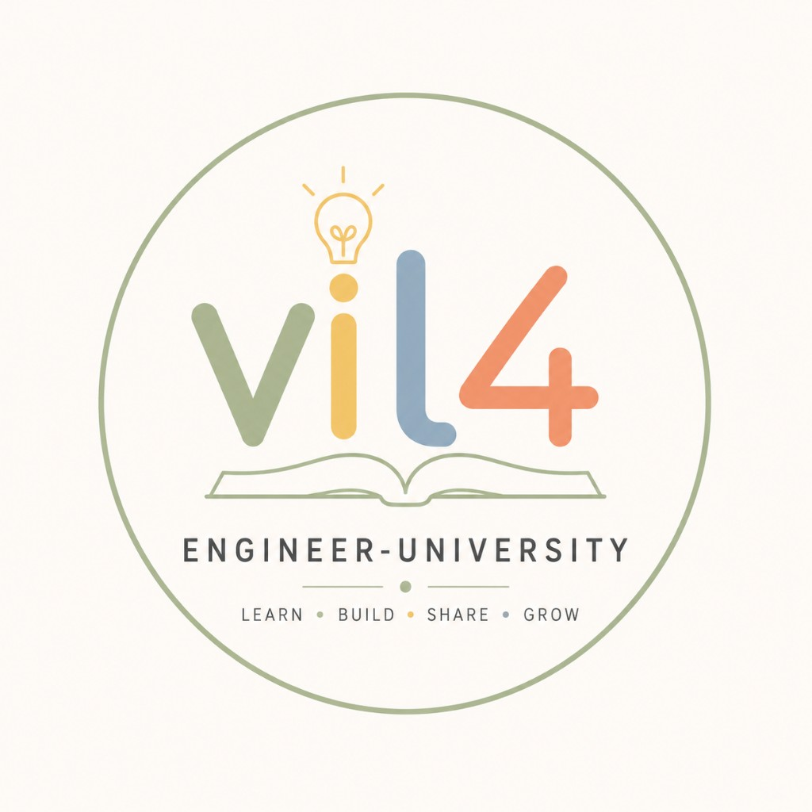

# Engineering University

  

Building engineers, not collecting knowledge.

Living curriculum and campus OS for Software Engineering — with Mobile Systems as foundation faculty, and AI as both **tool** and **technology**.

| | |
|--|--|
| **Site** | [engineering-university.github.io](https://engineering-university.github.io/) |
| **Campus** | [Enter Campus](https://engineering-university.github.io/#/campus/) |
| **Charter** | [01_CHARTER](https://engineering-university.github.io/#/01_CHARTER) |

Public university materials only. Private career OS stays separate.
